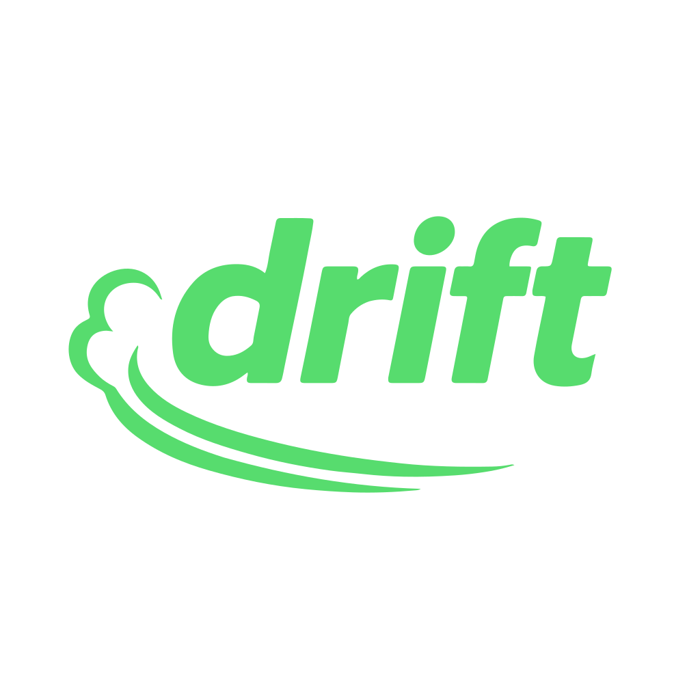

# Drift



Drift is a systems programming language focused on deterministic resource management, explicit ownership, and scalable concurrency. It combines C++-style RAII with Rust-like borrowing rules, while keeping the syntax compact and readable.

- **Safety-first design** – deterministic ownership, explicit moves, and no raw pointers in userland.
- **Escape hatches on demand** – you opt into `lang.abi` / `@unsafe` only when you really need low-level control.
- **Zero-cost abstractions** – traits, interfaces, and concurrency compile down to what you’d hand-write.
- **Virtual-thread concurrency** – synchronous-looking code scales via lightweight threads and structured scopes.
- **Interop without foot-guns** – precise binary layouts and opaque ABI handles keep FFI predictable.
- **Signed modules** – compiled modules are cryptographically signed so imports can be verified everywhere.

📖 **Full specification:** [docs/design/drift-lang-spec.md](docs/design/drift-lang-spec.md)
📜 **Formal grammar:** [docs/design/drift-lang-grammar.md](docs/design/drift-lang-grammar.md)

## References

- Error handling comparison for Rustaceans: [docs/articles/drift_vs_rust_error_handling.md](docs/articles/drift_vs_rust_error_handling.md)
- DMIR/SSA design: [docs/articles/design-first-afm-then-ssa.md](docs/articles/design-first-afm-then-ssa.md)
- DMIR specification: [docs/design/dmir-spec.md](docs/design/dmir-spec.md)
- Borrowing/reference model revision: [docs/design/drift_borrowing_and_reference_model_revision.md](docs/design/drift_borrowing_and_reference_model_revision.md)
- Iteration model: [docs/design/drift-loops-and-iterators.md](docs/design/drift-loops-and-iterators.md)
- String runtime plan: [docs/design/drift-string-impl.md](docs/design/drift-string-impl.md)
- Tuple destructuring notes: [docs/design/drift-tuple-destructuring.md](docs/design/drift-tuple-destructuring.md)
- Driver/runtime notes: [docs/articles/driver-notes.md](docs/articles/driver-notes.md)
- Development history: [docs/history.md](docs/history.md)
- Project TODO/roadmap: [docs/TODO.md](docs/TODO.md)
- Minimal toolchain (prototype):
  - `lang/driftc.py` — straight-line Drift → MIR → LLVM driver (emits LLVM IR/object via llvmlite/LLVM 15).
  - `lang/mir_to_llvm.py` — MIR → LLVM emitter for the straight-line subset (single-block, const/move/copy/binary/return).
  - `just mir-codegen` — lowers `tests/mir_lowering/add.drift` to an object, links with clang-15, and runs the binary.

## Quick Tour

### Hello Drift

```drift
import sys.console.out

fn main() returns Void {
    val greeting = "hello, drift"
    out.writeln(greeting)
}
```

### Structs, ownership, and methods

```drift
struct Point { x: Int64, y: Int64 }

implement Point {
    fn move_by(self: &mut Point, dx: Int64, dy: Int64) returns Void {
        self.x += dx
        self.y += dy
    }
}

fn translate(p: &mut Point, dx: Int64, dy: Int64) returns Void {
    p.x += dx
    p.y += dy
}
```

### Collection literals with type inference

```drift
fn numbers() returns Array<Int64> {
    val xs = [1, 2, 3]          // inferred Array<Int64>
    var ys: Array<Int64> = [4, 5, 6]
    ys[1] = 42                 // requires `var`
    return xs + ys
}
```

### Concurrency at eye level

```drift
import std.concurrent as conc

fn main() returns Void {
    conc.scope(fn(scope: conc.Scope) returns Void {
        val user = scope.spawn(fn() returns User { load_user(42) })
        val data = scope.spawn(fn() returns Data { fetch_data() })
        render(user.join(), data.join())
    })
}
```

## Getting Started

Use the MIR+LLVM prototype to lower and run a sample:

```bash
just mir-codegen
```

See the full language specification in [docs/design/drift-lang-spec.md](docs/design/drift-lang-spec.md) for semantics and examples. The full formal grammar lives in [docs/design/drift-lang-grammar.md](docs/design/drift-lang-grammar.md).
